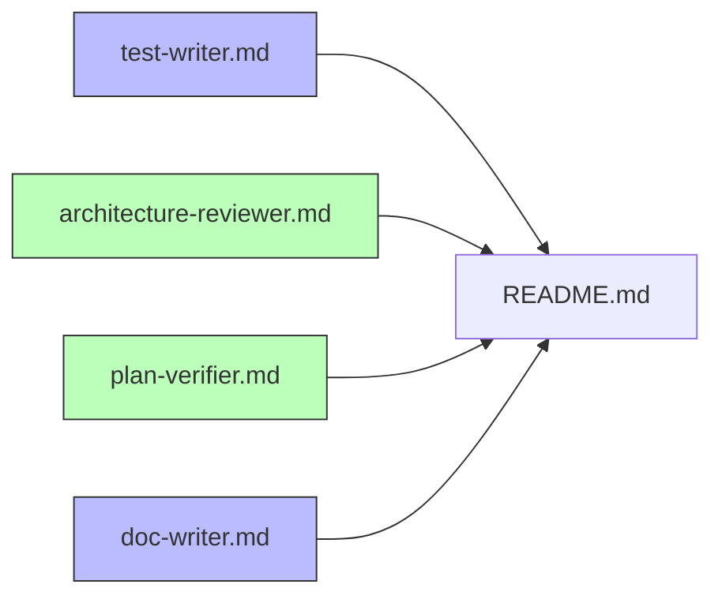

# Development Plan — Four new Claude Code agents (`test-writer`, `architecture-reviewer`, `plan-verifier`, `doc-writer`)

## 1. Goal

Add four new Claude Code subagent definitions under `.claude/agents/` so the existing
`researcher → planner → implementer` pipeline gains: a **test author**, an **architecture
reviewer**, a **plan-traceability verifier**, and a **documentation writer**. Each is a
single markdown file with YAML frontmatter (`name`, `description`, `tools`, `model`,
optional `skills:`) plus an English system-prompt body, matching the shape, tone, and
conventions of the three existing agents. This is a **meta/tooling task**: we are authoring
agent-definition files and updating `.claude/agents/README.md`. We are NOT writing feature
code in `server/`, `client/`, or `reviewer-core/`. Outcome: four well-formed, routable
agents plus a README catalog that lists them.

## 2. Scope

**In scope**
- Create `.claude/agents/test-writer.md`
- Create `.claude/agents/architecture-reviewer.md`
- Create `.claude/agents/plan-verifier.md`
- Create `.claude/agents/doc-writer.md`
- Update `.claude/agents/README.md` (catalog table + one prose section per new agent +
  any convention note the new agents introduce)

**Out of scope**
- No production code in `server/`, `client/`, `reviewer-core/`, `e2e/`.
- No new skills under `.claude/skills/**` (we only reference existing ones).
- No edits to the canonical file→skill routing table in `pr-self-review/SKILL.md`,
  `planner.md`, or `implementer.md` — these new agents do not change that table. (If a
  future change DID touch it, all three must move in lockstep — see Risks.)
- No `.claude/settings.json` / hook wiring. Agents route via their `description` only.

## 3. Module map consulted

| Source | Why |
|---|---|
| `.claude/agents/README.md` | Catalog format, "Conventions for adding/editing agents", `paths:`-bug note, lockstep rule. Must add rows + sections here. |
| `.claude/agents/researcher.md` | Canonical shape for a **read-only** agent (no Edit/Write/Agent; Bash read-only list; structured output template; "reply in language of the request"). Template for `architecture-reviewer` and `plan-verifier`. |
| `.claude/agents/implementer.md` | Canonical shape for a **write-capable** agent (`tools: …, Edit, Write, Skill`; `skills:` preload list; the file→skill routing table). Template for `test-writer` and `doc-writer`. |
| `.claude/agents/planner.md` | Plan section structure that `plan-verifier` must parse (sections 6/8/9), and the `skills:` preload pattern. |
| `.claude/skills/*` | The skills each agent preloads must exist — verified all 14 present. |
| `server/src/adapters/mocks.ts`, `server/test/helpers/pg.ts`, `TESTING.md`, `server/src/vendor/shared/contracts/findings.ts` | Concrete test infra + severity vocabulary `test-writer`/reviewers must cite. All verified present. |
| `docs/specs/conventions.md`, `docs/agent-prompts/`, `server|client|reviewer-core/docs/README.md` | Doc-placement targets `doc-writer` must know. Verified: package `docs/` dirs hold a single `README.md` stub today. |

## 4. Insights to respect

Pulled from `.claude/agents/README.md` (the project's own agent-authoring conventions —
treat as binding):
- Body in **English**; agent replies in the **language of the request** — `README.md:78-79`.
- **Explicit `tools` allowlist**; omit `Agent` unless the agent must spawn subagents;
  read-only = omit Edit/Write/Agent — `README.md:80-81`, `implementer.md:11`,
  `researcher.md:9`.
- **`description` is the router** — must say when to use AND when NOT to use, plus trigger
  phrases — `README.md:82`, every existing agent's frontmatter.
- **Skill links are relative** `../skills/<name>/SKILL.md` — resolves from both
  `.claude/agents/` and `.claude/plans/` — `README.md:83-84`.
- **Never use `paths:` frontmatter on skills** (claude-code Issue #49835) — `README.md:85-87`.
- `Skill` in `tools:` = invoke skills at runtime; the `skills:` list = preload at startup —
  established by `implementer.md:11-25` / `planner.md:12-27`.
- Severity vocabulary across the repo is **CRITICAL | WARNING | SUGGESTION**
  (`pr-self-review/SKILL.md`, mirrors `server/src/vendor/shared/contracts/findings.ts`) —
  reviewer agents must use this, not Claude Code's built-in Important/Nit.
- Test split: `*.it.test.ts` = DB-backed testcontainers Postgres; everything else hermetic.
  Unit lane `pnpm exec vitest run --exclude '**/*.it.test.ts'`; IT lane
  `pnpm exec vitest run .it.test` — `CLAUDE.md` / `TESTING.md`.

## 5. Files to modify / create

All under `.claude/` — no package source touched.

**Create**
- `/Users/mariana/IdeaProjects/dev-digest/.claude/agents/test-writer.md`
- `/Users/mariana/IdeaProjects/dev-digest/.claude/agents/architecture-reviewer.md`
- `/Users/mariana/IdeaProjects/dev-digest/.claude/agents/plan-verifier.md`
- `/Users/mariana/IdeaProjects/dev-digest/.claude/agents/doc-writer.md`

**Modify**
- `/Users/mariana/IdeaProjects/dev-digest/.claude/agents/README.md`

## 6. Per-agent specification

> Labeling note: the standard plan labels (`[SERVER]`/`[CLIENT]`/`[SHARED]`/`[TEST-UNIT]`/
> `[TEST-IT]`) describe code slices and don't fit a docs/tooling task. This plan uses
> `[AGENT]` for each agent-definition file and `[DOCS]` for the README update. The
> file→skill routing table (which keys off `*.ts`/`*.tsx` paths) therefore does **not**
> trigger here — we are writing markdown. The only authoring skill that applies is
> `mermaid-diagram` (optional, if a slice adds a diagram). See "Skills per task".

### 6.1 `test-writer.md` (write-capable) — Task T1

**Frontmatter**
```yaml
name: test-writer
description: >-
  <Router. WHEN to use: "write tests for X", "add a test", "cover this module/component
  with tests", backend (Fastify+Drizzle+Vitest) OR frontend (Next+React+RTL+Vitest).
  WHEN NOT: production feature code (use implementer), architectural judgement (use
  architecture-reviewer), verifying a plan (use plan-verifier). Trigger phrases included.>
tools: Read, Grep, Glob, Bash, Edit, Write, Skill
model: sonnet
skills:
  - react-testing-library
  - fastify-best-practices
  - drizzle-orm-patterns
  - onion-architecture
  - typescript-expert
  - zod
  - security
```

**Body sections the system prompt MUST contain**
1. **Identity** — writes automated tests for BOTH backend and frontend; does not change
   production code except where a test seam genuinely requires it (note the boundary).
2. **Test philosophy** — quote `TESTING.md`: "typological, not exhaustive" — one happy
   path + the one edge that matters; skip tests that wouldn't catch a real regression class.
   Cite the Testing-Trophy / Kent C. Dodds line from `react-testing-library`.
3. **Repo test split** — `*.it.test.ts` = DB-backed (testcontainers Postgres,
   `server/test/helpers/pg.ts` — `startPg`/`dockerAvailable`); everything else hermetic.
   Unit lane `pnpm exec vitest run --exclude '**/*.it.test.ts'`; IT lane
   `pnpm exec vitest run .it.test`. Default to unit; reach for IT only when a
   repository/DB path is the thing under test.
4. **Backend test patterns** — `buildApp({config, db, overrides})` + `app.inject()`; mock
   adapters from `server/src/adapters/mocks.ts` (`MockLLMProvider`, `MockGitClient`,
   `MockGitHubClient`) injected via the container; assert on injected reply shape, not
   internals.
5. **Frontend test patterns** — `vi.mock` hooks, `vi.mock("next/navigation")`,
   `NextIntlClientProvider` wrapper, `userEvent.setup()`, `screen` role/label queries,
   `afterEach(cleanup)`, `findBy*` for async.
6. **Per-file skill routing** — embed the standard routing table (so it applies the right
   skills to the FILES IT TESTS): `client/**/*.{test,spec}.{ts,tsx}` →
   [react-testing-library](../skills/react-testing-library/SKILL.md); `server/src/**/*.ts`
   → [onion-architecture](../skills/onion-architecture/SKILL.md) +
   [fastify-best-practices](../skills/fastify-best-practices/SKILL.md); repository/Drizzle →
   [drizzle-orm-patterns](../skills/drizzle-orm-patterns/SKILL.md); Zod →
   [zod](../skills/zod/SKILL.md); all → [typescript-expert](../skills/typescript-expert/SKILL.md)
   and [security](../skills/security/SKILL.md).
7. **Anti-pattern guardrail (CRITICAL, explicit forbid-list)** — grounded in the
   over-mocking research (arxiv 2602.00409: AI agents over-mock 36% vs 26% and write
   tautological assertions). FORBID: over-mocking (mocking the subject under test, mocking
   your own modules/hooks/context), snapshot tests, `fireEvent`, `container.querySelector`,
   importing from `jest`, asserting `useState`/internal hook state, and tautological
   assertions (asserting a mock returns what you told it to). Mock only at boundaries
   (network/adapters/external SDKs).
8. **Self-check loop** — run the unit lane (and IT lane only if DB-touching) in the affected
   package; iterate a bounded number of times; stop and report if not green.
9. **Output** — reply in the language of the request: files created/changed, exact test
   commands run + result, what was deliberately NOT tested and why.

### 6.2 `architecture-reviewer.md` (read-only) — Task T2

**Frontmatter**
```yaml
name: architecture-reviewer
description: >-
  <Router. WHEN: "review the architecture/layering", "is this in the right layer", "check
  module boundaries", onion (server) or frontend layering. WHEN NOT: writing/fixing code
  (read-only — use implementer), general bugs/security only (use pr-self-review), test
  authoring (use test-writer). Trigger phrases included.>
tools: Read, Grep, Glob, Bash, Skill
model: sonnet
skills:
  - onion-architecture
  - frontend-architecture
```
(NO Edit/Write/Agent — read-only by design, like `researcher`.)

**Body sections**
1. **Identity & hard read-only rules** — copy the read-only contract from `researcher.md`
   (Bash limited to `rg`/`grep`/`find`/`ls`/`cat`/`git log|show|blame`; no mutation; never
   edits, only reports). Explicitly: **never rewrites code** — it cites and recommends.
2. **Grounding rule (diff-scoped)** — only flag lines present in the current diff. Mirror
   the `pr-self-review` Step-1 throwaway-index technique: diff staged+unstaged+untracked vs
   HEAD; do not flag pre-existing debt outside the change.
3. **What it checks (backend)** — onion dependency direction routes→service→domain→
   repository. CRITICAL anti-patterns: inline Drizzle in `service.ts`; domain importing
   Fastify/Drizzle/adapters; cross-module sibling imports. WARNING: DB-in-route, fat
   orchestrator, manual body parsing. Reference
   [onion-architecture](../skills/onion-architecture/SKILL.md).
4. **What it checks (frontend)** — `lib → components → app` direction; colocate-first.
   CRITICAL: cross-route sibling imports. WARNING: business logic in `page.tsx`/component
   body, utils performing I/O. Reference
   [frontend-architecture](../skills/frontend-architecture/SKILL.md).
5. **Severity vocabulary** — output strictly **CRITICAL | WARNING | SUGGESTION** (mirrors
   `server/src/vendor/shared/contracts/findings.ts`); never Claude's built-in Important/Nit.
6. **Output format** — a findings list, each: severity, `path:line` citation, the rule it
   violates (with skill name), and a concrete recommendation (no code rewrite). Plus a
   short summary line counting findings by severity. Always include an explicit "no
   architectural issues found in this diff" path when clean.

### 6.3 `plan-verifier.md` (read-only) — Task T3

**Frontmatter**
```yaml
name: plan-verifier
description: >-
  <Router. WHEN: "verify the plan was implemented", "did we build everything in
  .claude/plans/<slug>.md", requirements-traceability of an already-written change against
  its Development Plan. WHEN NOT: best-practices/architecture judgement (use
  architecture-reviewer), bug hunting (use pr-self-review), writing tests (use test-writer).
  Caller must name the plan slug. Trigger phrases included.>
tools: Read, Grep, Glob, Bash
model: sonnet
```
(NO Skill, NO Edit/Write/Agent — pure read-only traceability; needs no skill preload.)

**Body sections**
1. **Identity & read-only rules** — same read-only Bash contract as `researcher`.
2. **Input** — a plan at `.claude/plans/<slug>.md` + the already-written code. The caller
   must supply the slug (note: no plan files exist yet, so never assume a default — if no
   slug given, ask for it / list `.claude/plans/`).
3. **Focus boundary** — requirements-**traceability only**: "was each requirement/task
   implemented?" — NOT general best-practices, style, or architecture (that's
   `architecture-reviewer`).
4. **Plan parsing** — read plan section **6** (ordered task checklist with
   `[SERVER]/[CLIENT]/[SHARED]/[TEST-UNIT]/[TEST-IT]` labels), section **8** (file
   ownership), section **9** (acceptance criteria). Enumerate every task as a row.
5. **Three-level verification** (Feb-2026 agentic-architecture playbook): **L1** file
   exists; **L2** substantive implementation, not a stub/TODO; **L3** wired —
   imported/registered/exported/called (e.g. route registered in `modules/index.ts`,
   component rendered, schema referenced).
6. **Output: traceability table** —
   `| Task | Label | Owned files | Status (COVERED/PARTIAL/MISSING) | Evidence file:line | Gap |`
   then a summary line `N total: X COVERED, Y PARTIAL, Z MISSING`. **Any MISSING is
   blocking.** State explicitly whether acceptance criteria (section 9) appear satisfiable.
7. **Honesty** — distinguish "verified absent" from "couldn't check"; never mark COVERED
   without a file:line evidence citation.

### 6.4 `doc-writer.md` (write-capable) — Task T4

**Frontmatter**
```yaml
name: doc-writer
description: >-
  <Router. WHEN: "document this", "write docs for the feature", "turn this plan/spec into
  documentation", "add a diagram of X". Documents ALREADY-implemented functionality and
  converts plans/specs/artifacts into docs with Mermaid diagrams, placing each doc
  correctly. WHEN NOT: writing/changing the code being documented (use implementer),
  reviewing (use architecture-reviewer), tests (use test-writer). Trigger phrases included.>
tools: Read, Grep, Glob, Bash, Edit, Write, Skill
model: sonnet
skills:
  - mermaid-diagram
  - onion-architecture
  - frontend-architecture
```

**Body sections**
1. **Identity** — documents already-built functionality and converts Implementation/
   Development Plans + given artifacts into docs. Does NOT change the documented code.
2. **Grounding rule** — Read source and cite `file:line` before any claim; never write from
   memory. (Same honesty bar as `researcher`.)
3. **Doc placement decision table** —
   - package architecture/how-to → `<package>/docs/<topic>.md` (today these dirs hold only
     a `README.md` stub — `server/docs/`, `client/docs/`, `reviewer-core/docs/`).
   - feature spec / converted dev plan → `<package>/specs/<feature>.md` or
     `docs/specs/<feature>.md` (follow the existing `docs/specs/conventions.md` template).
   - cross-cutting topic → `docs/<topic>.md`.
   - reviewer prompts → `docs/agent-prompts/`.
4. **Spec template** — Goal → Scope → Data Model → API → Pipeline → UI → Contracts →
   Testing → Trade-offs (as in `docs/specs/conventions.md`).
5. **Diátaxis** — keep tutorial / how-to / reference / explanation types separate; don't
   blend a reference and a tutorial in one doc.
6. **Mermaid diagram selection** (via [mermaid-diagram](../skills/mermaid-diagram/SKILL.md)):
   sequence for service/request flows, ER for schema, flowchart for module structure, class
   for types, state for transitions. Reference
   [onion-architecture](../skills/onion-architecture/SKILL.md) and
   [frontend-architecture](../skills/frontend-architecture/SKILL.md) to describe structure
   accurately.
7. **DO-NOT-CLOBBER hard list** — never overwrite: `INSIGHTS.md`, `AGENTS.md`, `CLAUDE.md`,
   `.claude/skills/**`, existing `.claude/agents/**`, `.claude/plans/**`,
   `*/vendor/shared/**`, `server/src/db/migrations/**`. Create new doc files or append; do
   not clobber these.
8. **Output** — reply in the language of the request: which docs were written/updated (with
   absolute paths), where each was placed and why, and any diagrams added.

## 7. Skills per task

Because every deliverable is a **markdown** file, the code-focused routing table
(`*.ts`/`*.tsx` → onion/react/etc.) does **not** apply to authoring. The skills that matter
per task are:

| Task | File | Authoring skills to apply |
|---|---|---|
| T1 `[AGENT]` test-writer | `.claude/agents/test-writer.md` | none required to author markdown. (Verify the body's `skills:` preload + routing table reference real `../skills/*/SKILL.md` paths.) |
| T2 `[AGENT]` architecture-reviewer | `.claude/agents/architecture-reviewer.md` | same — verify referenced skill links resolve. |
| T3 `[AGENT]` plan-verifier | `.claude/agents/plan-verifier.md` | same — note: no `skills:` preload, no `Skill` tool. |
| T4 `[AGENT]` doc-writer | `.claude/agents/doc-writer.md` | [mermaid-diagram](../skills/mermaid-diagram/SKILL.md) (optional, only if adding an illustrative diagram). |
| T5 `[DOCS]` README update | `.claude/agents/README.md` | none. |

(For reference, the canonical code routing table the new agents EMBED lives in
[`../skills/pr-self-review/SKILL.md`](../skills/pr-self-review/SKILL.md).)

## 8. File ownership (parallel authoring slices)

Each agent file is independent, so up to four authors can run in parallel with
non-overlapping file sets. The README is shared, so it is a single-owner, dependent task.

| Slice | Owns (exclusive) | Tasks |
|---|---|---|
| **A** | `.claude/agents/test-writer.md` | T1 |
| **B** | `.claude/agents/architecture-reviewer.md` | T2 |
| **C** | `.claude/agents/plan-verifier.md` | T3 |
| **D** | `.claude/agents/doc-writer.md` | T4 |
| **E (coordinator)** | `.claude/agents/README.md` | T5 — runs **after** A–D land (needs all four file names/descriptions to write rows + sections). Single owner of README to avoid append collisions. |

No two slices touch the same file. `.claude/agents/README.md` is owned solely by Slice E.

## 9. Ordered task checklist

- [ ] **T1 `[AGENT]`** Author `test-writer.md` per §6.1. Deps: none. Owner: Slice A.
- [ ] **T2 `[AGENT]`** Author `architecture-reviewer.md` per §6.2. Deps: none. Owner: Slice B.
- [ ] **T3 `[AGENT]`** Author `plan-verifier.md` per §6.3. Deps: none. Owner: Slice C.
- [ ] **T4 `[AGENT]`** Author `doc-writer.md` per §6.4. Deps: none. Owner: Slice D.
- [ ] **T5 `[DOCS]`** Update `README.md`: add one catalog-table row per new agent (Agent /
      Model / Tools / Role) and one prose subsection per agent mirroring the existing
      `researcher`/`planner`/`implementer` sections; note the new writer/reviewer roles.
      Deps: T1–T4. Owner: Slice E.



## 10. Acceptance criteria

These are file-shape and routability checks (no `pnpm` build/test — nothing compiles here).

1. **All five files exist** —
   `ls .claude/agents/{test-writer,architecture-reviewer,plan-verifier,doc-writer}.md .claude/agents/README.md`.
2. **Valid frontmatter** — each new agent opens with a `---` fenced YAML block containing
   `name`, `description`, `tools`, `model`; verify with a YAML parse, e.g.
   `for f in test-writer architecture-reviewer plan-verifier doc-writer; do awk '/^---$/{c++; next} c==1' .claude/agents/$f.md | python3 -c 'import sys,yaml; d=yaml.safe_load(sys.stdin); print(d["name"], d["tools"], d["model"])'; done`.
3. **`name` matches filename** — `name:` value equals the file basename for all four.
4. **Tool allowlists correct** —
   - `test-writer`, `doc-writer` include `Edit, Write, Skill`;
   - `architecture-reviewer` has `Skill` but **no** `Edit`/`Write`/`Agent`;
   - `plan-verifier` has **no** `Skill`/`Edit`/`Write`/`Agent` (only `Read, Grep, Glob, Bash`).
   Check: `grep -n '^tools:' .claude/agents/*.md`.
5. **`skills:` preloads exist** — every entry in each agent's `skills:` list resolves to a
   real `.claude/skills/<name>/SKILL.md`:
   `for s in $(grep -A20 '^skills:' .claude/agents/test-writer.md | grep '^  - ' | sed 's/  - //'); do test -f .claude/skills/$s/SKILL.md && echo "ok $s" || echo "MISSING $s"; done` (repeat per agent).
6. **No `paths:` frontmatter** — `! grep -rl '^paths:' .claude/agents/` (must find none).
7. **Relative skill links resolve** — every `../skills/<name>/SKILL.md` referenced in any
   new agent body points to an existing file:
   `grep -ohr '\.\./skills/[a-z-]*/SKILL.md' .claude/agents/*.md | sort -u | sed 's#\.\./#.claude/#' | while read p; do test -f "$p" && echo "ok $p" || echo "MISSING $p"; done`.
8. **`description` is a real router** — each new agent's `description` contains both a
   "when to use" and a "when NOT" clause plus trigger phrases (manual read).
9. **README routable** — `.claude/agents/README.md` catalog table has a row for each of the
   four new agents and a prose subsection for each; tools/model columns match the
   frontmatter.
10. **Severity vocabulary** — `architecture-reviewer.md` body uses
    `CRITICAL`/`WARNING`/`SUGGESTION` (grep for them) and does not introduce
    Important/Nit. `plan-verifier.md` uses `COVERED`/`PARTIAL`/`MISSING`.

## 11. Risks / do-not-touch

- **Lockstep table**: the code file→skill routing table is duplicated in
  `pr-self-review/SKILL.md`, `planner.md`, and `implementer.md`. These new agents must NOT
  diverge from it where they embed it (`test-writer`). Do not "improve" it in only one
  place — if it ever changes, change all copies together (`README.md:88-90`).
- **README is shared state**: only Slice E edits `.claude/agents/README.md`; parallel edits
  would collide. Serialize T5 after T1–T4.
- **No `paths:` on skills** — reiterated: never add `paths:` frontmatter (Issue #49835).
- **Do-not-clobber** (especially relevant to the `doc-writer` body it authors, but also for
  the author of these files): never overwrite `INSIGHTS.md`, `AGENTS.md`, `CLAUDE.md`,
  existing `.claude/agents/**`, `.claude/skills/**`, `.claude/plans/**`,
  `*/vendor/shared/**`, `server/src/db/migrations/**`.
- **Consistency**: keep tone, heading style, and "reply in the language of the request"
  ending identical to the existing three agents so the catalog reads uniformly.

## 12. Implementer contract

- Read the existing `researcher.md` / `implementer.md` / `planner.md` **before** authoring,
  and mirror their structure (frontmatter shape, numbered body sections, closing Output
  section).
- One agent file at a time; stay strictly within your slice's single owned file.
- Slice E waits for A–D, then edits only `README.md`.
- Write-capable agents being authored (`test-writer`, `doc-writer`) get `Edit, Write,
  Skill`; read-only agents (`architecture-reviewer`, `plan-verifier`) omit
  `Edit`/`Write`/`Agent` (and `plan-verifier` omits `Skill` too).
- After writing, run the §10 acceptance checks (they are `ls`/`grep`/YAML-parse only — no
  build).
- Reply in the language of the request with the files created and the §10 check results.
